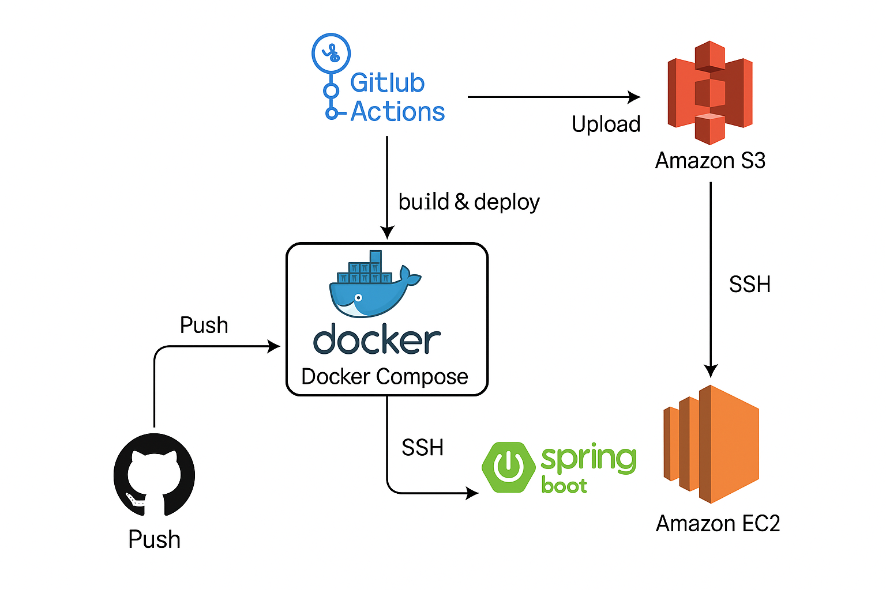
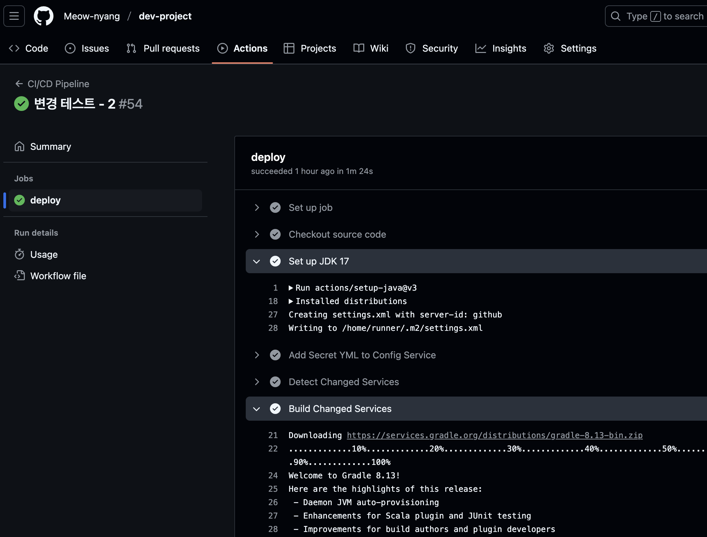
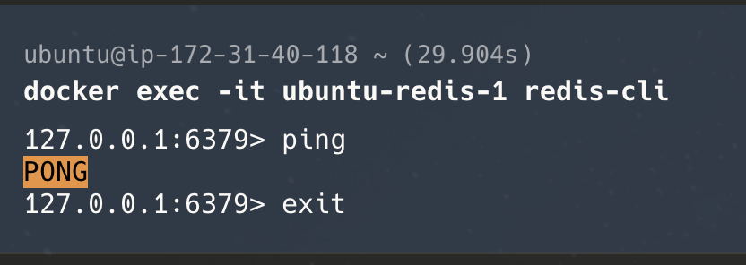

# DevOps 단위 프로젝트 산출물 작성 가이드

## 📋 프로젝트 개요

- **기반 프로젝트**: 기존 Flea-Market 서비스 프로젝트
- **핵심 기술**: Docker, GitHub Actions, EC2, S3 등
- **목표**: 기존에 작성된 MSA 구조에서 DevOps 파이프라인 구축
- **_팀장:_** 주영찬
- **_팀원:_** 김사무엘

---


### 1. 기획서


- **MSA 전환 계획**

  사용자 서비스, 상품 서비스, 게시글 서비스, 거래 서비스, Config 서비스, API 게이트웨이, 유레카 서버 등을 기존 모놀리식 구조에서 분리할 계획 입니다.

- **서비스 간 통신 방식 (REST API)**

  서버스 간 통신 설계 게시글 서비스 -> 제품 서비스
  목적: 유저가 등록한 게시글의 제품을 product table에 저장
  통신 방식: REST API 호출 (Feign Client)
  엔드포인트: /product-service/product/create

  거래 서비스 -> 게시글 서비스
  목적: 게시글의 거래 상태 변경
  통신 방식: REST API 호출 (Feign Client)
  엔드포인트: /board-service/board/{boardId}

  거래 서비스 -> 제품 서비스
  목적: 제품의 거래 상태 변경
  통신 방식: REST API 호출 (Feign Client)
  엔드포인트: /product-service/product/{prodId}

- **DevOps 도구 적용 계획**

  - 사용할 DevOps 도구 선택 근거 (Docker, GitHub Actions, EC2)

         Docker: 앱을 컨테이너에 담아 어디서든 똑같이 실행 할 수 있습니다.

         GitHub Actions: 개발 과정을 자동화하고 빠르게 배포 할 수 있습니다.

         EC2: SSH로 직접 접근 가능하며, Docker 및 다양한 인프라 구성을 자유롭게 구성할 수 있음.


- CI/CD 파이프라인 구성 계획

      코드 관리 (GitHub) 
      - 모든 코드는 GitHub에 저장하고, GitFlow처럼 main 브랜치는 항상 배포 가능한 상태를 유지합니다. 
      새 기능 개발은 새 브랜치에서 진행하고, **Pull Request (PR)**로 코드 리뷰를 꼭 거칩니다.

      CI (지속적 통합) - GitHub Actions
      - 코드를 main 브랜치에 올리거나 PR을 만들 때마다 코드 컴파일 후 Docker 이미지로 만들고 테스트 후  Docker 이미지를 AWS에 저장합니다.

      CD (지속적 배포) - GitHub Actions
      - CI 성공 후 main 브랜치에 코드가 병합되면 GitHub Actions가 AWS EC2에 접속하여 배포를 지시하고 업데이트를 실시합니다.
- 모니터링 및 로깅 전략

      모니터링
      -앱 성능: 사용자 요청 얼마나 빨리 응답하는지, 에러는 없는지.
      
      -서비스 간 연결: 각 서비스들이 서로 통신 잘하는지.

      로깅
      -각 서비스에서 발생하는 모든 활동 기록 (오류 메시지, 사용자 로그인 등)..


- **배포 전략**
  - GitHub Actions 적용 방안

        -배포 트리거: GitHub Actions에서 Docker 이미지 빌드 후, 배포 설정 파일의 이미지 버전을 Git에 업데이트하는 PR을 생성합니다.

        -변경된 부분만 찾아서 푸쉬 및 빌드

- 기대 효과 및 성과 지표

        -기대 효과: 개발 속도 향상, 배포 효율 증대, 서비스 안정성 향상, 비용 절감, 팀 협업 강화입니다. 
- 
        -성과 지표: 배포 주기, 배포 빈도, 배포 성공률, 오류율, 장애 발생률을 참고 합니다.
---

### 2. 요구사항 정의서

- 기능적 요구사항 (새로운 기능)
  ```
  REQ-F-001: 서비스 디스커버리: 각 서비스가 유레카 서버에 자동으로 등록하고 서로를 찾을 수 있어야 합니다. (모든 서비스, 유레카 서버)
  REQ-F-002: API 게이트웨이: 모든 외부 요청은 API 게이트웨이를 통해 들어오며, 여기서 인증/보안/라우팅 등 공통 처리를 담당해야 합니다. (API 게이트웨이, 모든 서비스)
  REQ-F-003: 중앙 설정 관리: 서비스별 설정(DB 정보 등)을 구성 서비스에서 한 곳에 모아 관리하고, 동적으로 적용 가능해야 합니다. (구성 서비스, 모든 서비스)
  REQ-F-004: 통합 로깅/모니터링 데이터 수집: 모든 서비스의 로그와 성능 데이터를 한 곳에 모아 관리해야 합니다. (모든 서비스, EKS)

  ```


- 비기능적 요구사항 (시스템 품질)
  ```
  REQ-NF-01: 가용성 (99.9% 이상): 서비스가 99.9% 이상 항상 작동해야 합니다
  측정: 월별 가동 시간.
  검증: 모니터링, 장애 시나리오 테스트.
  REQ-NF-02: 성능 (응답 시간): 주요 기능(로그인, 조회 등)의 응답 시간이 특정 목표치(예: 500ms) 이내여야 합니다.
  측정: 각 API 응답 시간.
  검증: 성능 테스트.
  REQ-NF-03: 보안 (컨테이너/클러스터): Docker 이미지에 취약점이 없어야 합니다.
  측정: 이미지 취약점 없음.
  ```

- 운영 요구사항 (자동화 및 관리)

  ```
  REQ-OP-01: CI/CD 자동화: 코드 변경부터 EC2 배포까지 모든 과정이 GitHub Actions로 자동화되어야 합니다.
  측정: 배포 주기, 성공률.
  검증: 워크플로우 실행 확인.

  REQ-OP-02: 빠른 롤백: 문제 발생 시 5분 이내로 이전 안정적인 버전으로 되돌릴 수 있어야 합니다.
  측정: 롤백 시간.
  검증: 롤백 테스트.

  ```
---

### 3. 소스코드 (GitHub Repository에 업로드)
  ```
  https://github.com/Meow-nyang/dev-project

  ```

### 4. MSA 아키텍처 설계도



<br> <br/>


1. **Service Architecture Diagram**: 마이크로서비스 간 통신
2. **Infrastructure Diagram**: AWS EKS 인프라 구성
3. **CI/CD Pipeline Diagram**: 배포 파이프라인 플로우

---

### 5. 테스트 케이스

#### ✅ 테스트 유형별 케이스

- **Unit Test**

  - 각 마이크로서비스 내 비즈니스 로직 테스트
  - 커버리지 80% 이상 목표

- **Integration Test**

  - 서비스 간 API 통신 테스트
  - 데이터베이스 연동 테스트

- **End-to-End Test**

  - 전체 워크플로우 테스트
  - 사용자 시나리오 기반 테스트

- **Infrastructure Test**
  - 컨테이너 빌드/실행 테스트
  - Kubernetes 배포 테스트
  - CI/CD 파이프라인 테스트


Test-01: Github Actions
- 테스트 유형: Infrastructure Test
- 대상 서비스: board-service
- 전제조건: S3 버킷, EC2 생성, Secrets 설정
- 테스트 단계:
  1. 변경된 내용만 푸쉬
  2. EC2 서버에 빌드
- 성공 기준: 변경된 서비스만 빌드하여 EC2 서버에 이미지 생성
- 우선순위: High


Github Actions Test

<br> <br/>


Test-01: Rds Connection Test
- 테스트 유형: Integration Test
- 대상 서비스: Rds, EC2
- 전제조건: S3 버킷, Rds 생성
- 테스트 단계:
  1. Mysql Workbench 에서 접속 테스트
  2. EC2 서버와 연결
- 성공 기준: DB 접속 후 파일 업로드
- 우선순위: Middle


Test-02: Redis Test
- 테스트 유형: Integration Test
- 대상 서비스: Redis, EC2
- 전제조건: Docker 이미지
- 테스트 단계:
  1. ssh -i로 EC2 연결
  2. exec 으로 redis 접속
- 성공 기준: PING -> PONG 확인하기
- 우선순위: Low


<br> <br/>


---
### 6. 테스트 결과서


## 테스트 실행 개요
- 실행 일시: 2025-06-19 15:00
- 테스트 환경: EC2
- 실행자: 1팀/주영찬


## 테스트 결과 요약
- 전체 통과율: 03/03 (100%)
- Integration Test: 02/02 (100%)
- Infrastructure Test: 01/01 (100%)
